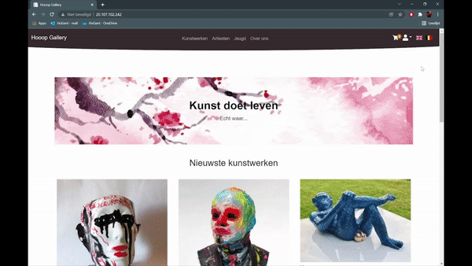

# Welcome to Hooop Gallery

This is the GitHub repository for DevOps project. You can find and clone all the source code in here.
This project is about a webshop for people who want to buy and sell art. This is a school project for Jean-Marie Waelkens.

## Demo

## Table of contents

> - [Used Technology](#Used-technology)
> - [Group members](#Group-members)
> - [Trello](#trello)

## Used Technology
 - MySql 
 - Sql Server
 - NuGet Packages
 - Auth0
 - BlobStorage
 - Playwright
 
## How to run

 - Clone project in visual studio
 - Change startup project to EuropArt.Server
 - Go to the startup.cs in EuropArt.Server and put line 42 in comment and line 44 out of comment
 - Finally run the project

## How to run the tests

 - Open a terminal in the project
 - Cd to EuropArt.Server and execute 'dotnet run'
 - Cd to EuropArt.PlaywrightTests and execute 'dotnet test'

## Group members

### Development

- Groupmember 1 : <https://github.com/wolfderechter> - De Rechter - Wolf
- Groupmember 2 : <https://github.com/stefboerjan> - Boerjan - Stef
- Groupmember 3 : <https://github.com/zowieverschuere>  - Verschuere - Zowie
- Groupmember 4 : <https://github.com/DylanDC666> - De Corte - Dylan
- Groupmember 5 : <https://github.com/EmielDehaen> - Dehaen - Emiel
- Groupmember 6 : <https://github.com/SimonBekaertt> - Bekaert - Simon

### Operations

- Groupmember 7 : <https://github.com/pietervankeer> - Van Keer - Pieter
- Groupmember 8 : <https://github.com/vic-rottiers> - Rottiers - Vic
